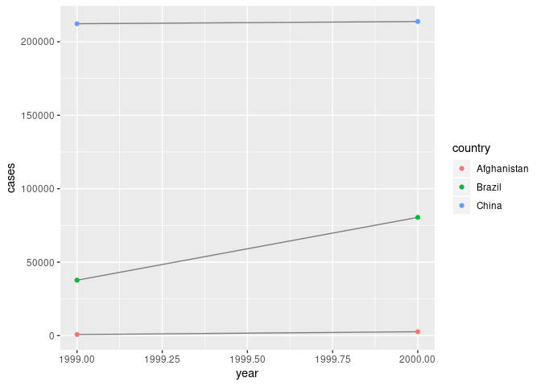

R Notebook
================

``` r
library(tidyverse)
```

    ## ── Attaching packages ────────────────────────────────────────────────────────────────────────────────────────────────────────────────── tidyverse 1.2.1 ──

    ## ✔ ggplot2 3.2.1     ✔ purrr   0.3.2
    ## ✔ tibble  2.1.3     ✔ dplyr   0.8.3
    ## ✔ tidyr   1.0.0     ✔ stringr 1.4.0
    ## ✔ readr   1.3.1     ✔ forcats 0.4.0

    ## ── Conflicts ───────────────────────────────────────────────────────────────────────────────────────────────────────────────────── tidyverse_conflicts() ──
    ## ✖ dplyr::filter() masks stats::filter()
    ## ✖ dplyr::lag()    masks stats::lag()

``` r
table1
```

    ## # A tibble: 6 x 4
    ##   country      year  cases population
    ##   <chr>       <int>  <int>      <int>
    ## 1 Afghanistan  1999    745   19987071
    ## 2 Afghanistan  2000   2666   20595360
    ## 3 Brazil       1999  37737  172006362
    ## 4 Brazil       2000  80488  174504898
    ## 5 China        1999 212258 1272915272
    ## 6 China        2000 213766 1280428583

``` r
table2
```

    ## # A tibble: 12 x 4
    ##    country      year type            count
    ##    <chr>       <int> <chr>           <int>
    ##  1 Afghanistan  1999 cases             745
    ##  2 Afghanistan  1999 population   19987071
    ##  3 Afghanistan  2000 cases            2666
    ##  4 Afghanistan  2000 population   20595360
    ##  5 Brazil       1999 cases           37737
    ##  6 Brazil       1999 population  172006362
    ##  7 Brazil       2000 cases           80488
    ##  8 Brazil       2000 population  174504898
    ##  9 China        1999 cases          212258
    ## 10 China        1999 population 1272915272
    ## 11 China        2000 cases          213766
    ## 12 China        2000 population 1280428583

``` r
table3
```

    ## # A tibble: 6 x 3
    ##   country      year rate             
    ## * <chr>       <int> <chr>            
    ## 1 Afghanistan  1999 745/19987071     
    ## 2 Afghanistan  2000 2666/20595360    
    ## 3 Brazil       1999 37737/172006362  
    ## 4 Brazil       2000 80488/174504898  
    ## 5 China        1999 212258/1272915272
    ## 6 China        2000 213766/1280428583

``` r
table4a
```

    ## # A tibble: 3 x 3
    ##   country     `1999` `2000`
    ## * <chr>        <int>  <int>
    ## 1 Afghanistan    745   2666
    ## 2 Brazil       37737  80488
    ## 3 China       212258 213766

``` r
table4b
```

    ## # A tibble: 3 x 3
    ##   country         `1999`     `2000`
    ## * <chr>            <int>      <int>
    ## 1 Afghanistan   19987071   20595360
    ## 2 Brazil       172006362  174504898
    ## 3 China       1272915272 1280428583

``` r
table1 %>% 
  mutate(rate = cases / population * 10000)
```

    ## # A tibble: 6 x 5
    ##   country      year  cases population  rate
    ##   <chr>       <int>  <int>      <int> <dbl>
    ## 1 Afghanistan  1999    745   19987071 0.373
    ## 2 Afghanistan  2000   2666   20595360 1.29 
    ## 3 Brazil       1999  37737  172006362 2.19 
    ## 4 Brazil       2000  80488  174504898 4.61 
    ## 5 China        1999 212258 1272915272 1.67 
    ## 6 China        2000 213766 1280428583 1.67

``` r
table1 %>% 
  count(year, wt = cases)
```

    ## # A tibble: 2 x 2
    ##    year      n
    ##   <int>  <int>
    ## 1  1999 250740
    ## 2  2000 296920

``` r
library(ggplot2)
ggplot(table1, aes(year, cases)) + 
  geom_line(aes(group = country), colour = "grey50") + 
  geom_point(aes(colour = country))
```

<!-- -->

1.  In table 1 variables are the columns and observations are organized
    by country and year.In table two it can be further subdivided by
    cases and population. table 3 has countries with observations by
    year and rate. Table four makes year a variable. has country and
    years as variables, with population listed beneath. The mutated
    tables split everything up nicely.

2.  1.  
    2.  
    3.  
    4.  
3.
